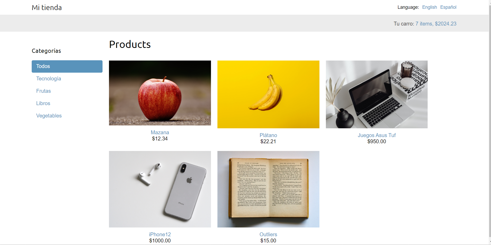
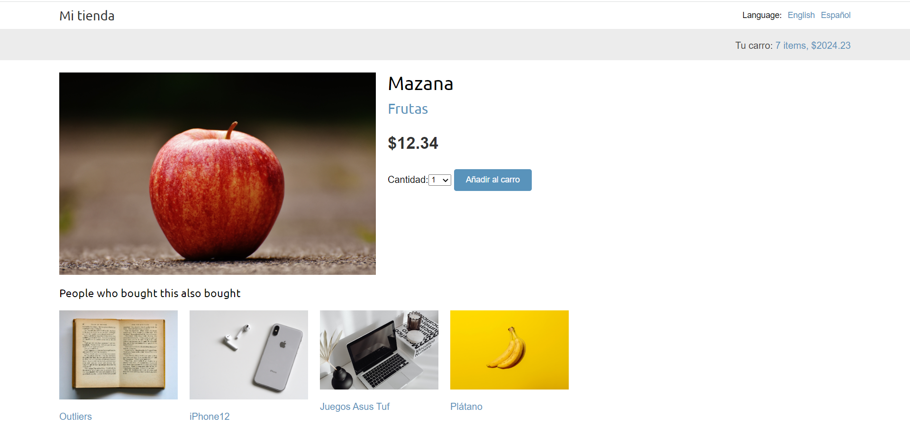
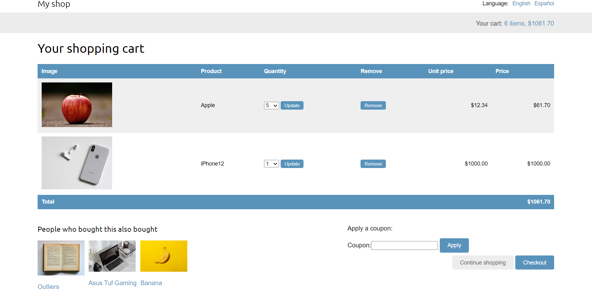
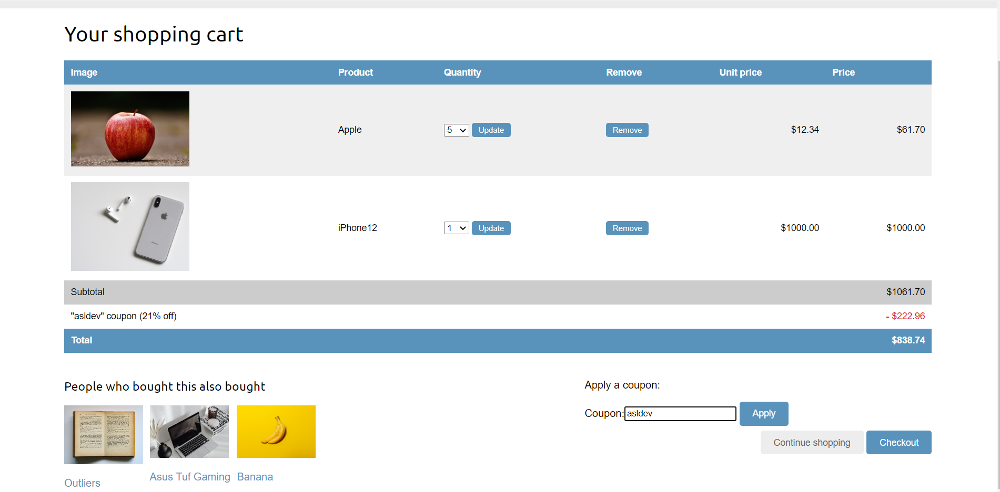
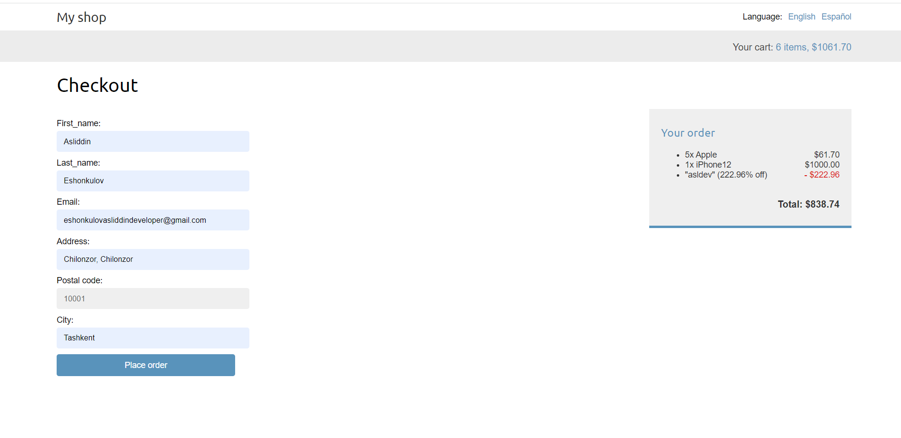
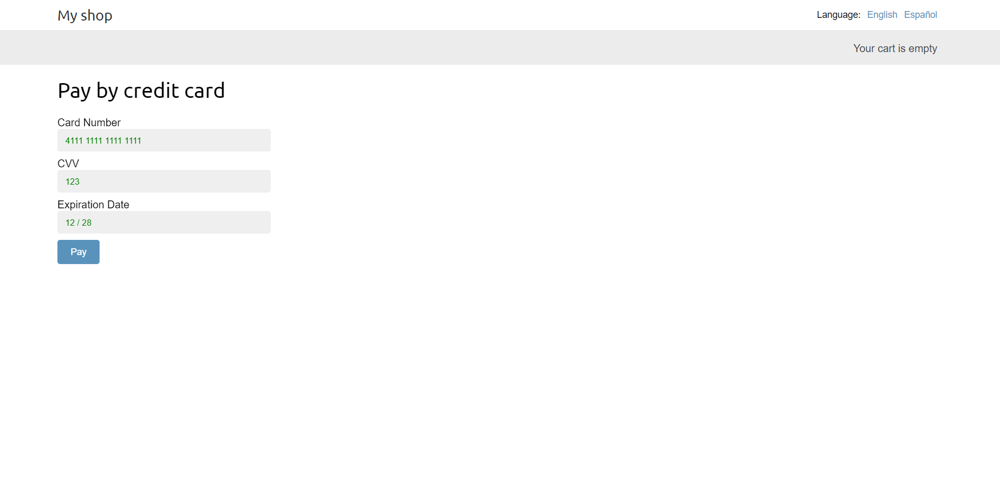
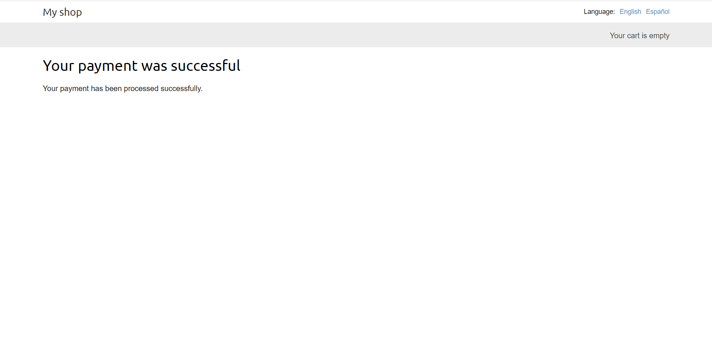
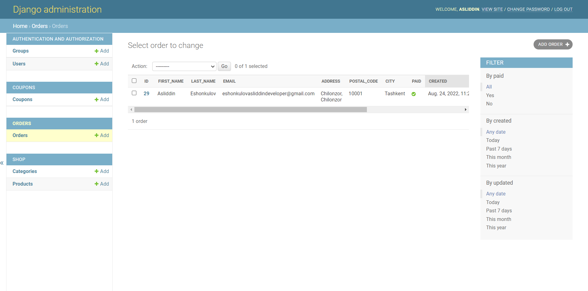
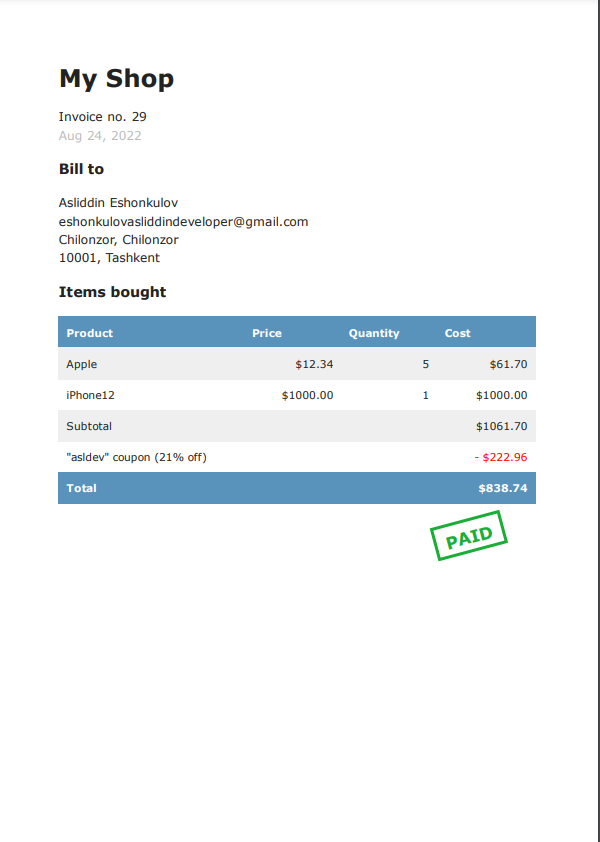

#  Fully Functional e-commerce website
# Installation guide
- pipenv install -r requirements.txt

# It is possible to change the language of the web page

# You can add an element to the cart. It includes recommendation engine

# Cart

# Apllying Coupon

# Order

# Pay by Visa Card
# The Visa Card integration is done by using Brain Tree Api

# If payment was Successfull

# Admin Page

# Check

